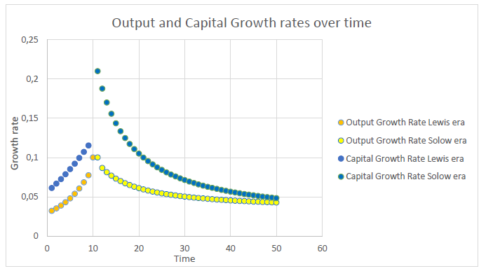

% Growth & Development - Lewis model
% Jordy Duits
% Tilburg University

Lewis model under Solow assumption
================

Assignment part a
----------

The Lewis model assumes that a fixed fraction of profits is reinvested; the Solow model assumes that a fixed  fraction of total income is reinvested. Let’s compare the two assumptions:  
    
- How does the Lewis model change if the Solow assumption about savings rates is used?   
- Show the dynamics of the models.

--------
  

**Subsistence Sector**  
output: 	$Y_s=A_sL_s$  
wages:		$w_s=A_s$  
    
  
**Modern Sector**  
output:	  $Y_m=A_mK^{a}_mL_m^{1-a}$  
wages: 	  $w_m= \frac{(1-a)Y_m}{L_m}$  
  
  
**Total Economy**  
output: $Y=Y_s+Y_m$    
wages:  $w_m={\varphi}w_s$  
  
And the labour market equilibrium is: $L=L_s+L_m$  
With the corresponding capital accumulation function: $\dot{K}= s_yY-{\delta}K$

--------

We can derive $L_m$ in equilibrium as a function of parameters:  
Because $w_m = {\varphi}w_s$  
  
\begin{align}  
\frac{(1-a)Y_m}{L_m} & = {\varphi}A_s 		\\
(1-a)A_mK_m^aL^{-a}_m & = {\varphi}A_s 	\\
L^{-a}_m & = \frac{{\varphi}A_s}{(1-a)A_mK^a_m} \\
L^{a}_m & = (\frac{(1-a)A_mK^a_m}{{\varphi}A_s})\\
L_m & = (\frac{(1-a)A_mK^a_m}{{\varphi}A_s})^{\frac{1}{a}}\\
L_m & = (\frac{(1-a)A_m}{{\varphi}A_s})^{\frac{1}{a}}K_m 
\end{align}  

--------

In the mature economy: $L_m=L$, with a corresponding capital level at the start of the maturity level of $K$:  
\begin{align}
L & = (\frac{(1-a)A_m}{{\varphi}A_s})^{\frac{1}{a}}K  \\
K & = L(\frac{{\varphi}A_s}{(1-a)A_m})^{\frac{1}{a}}K 
\end{align}    
  
  
As output in the economy is: 
\begin{align}
Y & = Y_s + Y_m		\\
& = A_sL_s + A_mK^a_mL^{1-a}_m		\\
& = A_s(L-L_m) = A_mK^a_m(\frac{LK}{K})^{1-a}		\\
& = A_sL + (\frac{{\varphi}-1+a}{1-a} (\frac{A_sL}{K}))K		\\
\end{align}  

--------  

This result is the same as in the Lewis model. In both models, the marginal product of capital is constant and we still have an AK-like growth model as an increase in capital still attracts labor to the modern sector. However the transition dynamics for capital change:  
   
$\hat{K} = \frac{s_yY-{\delta}K}{K}$ = $s_y(\frac{A_s}{k}+\frac{{\varphi}-1+a}{1-a}\frac{A_sL}{K})-{\delta}$ where $k=\frac{K}{L}$  
$\hat{Y}= (1-\frac{A_sL}{Y})\hat{K}$  

--------  
  
Thus, capital accumulation differs considerably under the assumption that savings are now a fixed part of total output, instead of a fixed part of the capitalists’ profits (Lewis’ assumption).  
Under Lewis’ assumption, we had that:    
  
$\hat{K}$ = $s_{\pi}aA_m({\frac{L}{K}})^{1-a}$ - $\delta$   
$\hat{Y} = (1-\frac{A_sL}{Y})\hat{K}$      

--------

**Conclusion part a**  
  
In the Lewis model with the Solow savings assumption, we see that capital accumulation firstly depends on the savings over total output. So not only capital owners, also labor can provide savings (households in general). Consequently, capital accumulation also depends on savings in the subsistence sector. This is visible in the capital accumulation equation where also $A_s$ is an important parameter now. However, the speed of capital growth decreases with a larger K (first term of the equation), though it always stays positive even if K $\rightarrow$ $\infty$ (due to the positive second term $({\varphi}+ a >1))$.  

Unified Growth: From Lewis to Solow 
=================

Assignment part b
-----------

 Show the dynamics of an economy that starts with small capital stock and surplus labor and show how it can finally reach the “mature stage” where the economy behaves like the Solow model. Show how the dynamics of the two regimes are linked.  

---------

We modelled this economy in excel, to check its development over 50 periods. To do so, values for the parameters are needed. The values for obtained from the paper of Mankiw, Romer and Weil (1992), or some realistic numbers are chosen. The values are summarized in table 1. Also initial values $K_0$ and $L_0$ are summarized in this table.   

---------

Based on these values, we expect the following to happen in this economy over time:   
  
*Output and capital growth*: In the Lewis era, the growth rate of capital and output are expected to increase fast as profits leads the modern sector to grow at an increasing pace, while the modern sector is extracting labor from the subsistence sector.  
Arriving in the Solow era, we expect the growth rates of output and capital to converge to, and will eventually arrive at, the long-run (steady state) expected growth rates:   
$\hat{K}$ = $\hat{Y}$ = $(\frac{1}{1-a})\hat{A}+\hat{L}$ = $(\frac{1}{1-0.33})0.02 +0.01 = 4$\%

---------
  
*Wages and profits growth*: In the Lewis era, all wages cannot grow faster than the marginal productivity of labor in the subsistence sector ($A_s$), which grows as a pace of 0.1\% per year. If wages of the modern sector tend to rise faster than subsistence sector wages, labor flows to the modern sector, reducing the MPL in the modern sector, thereby taking away the upward pressure on wages. This leads to a very fast growth of profits, as capital productivity grows at a very high pace, stimulated by these labor inflows from the subsistence sector.  

---------

From off the Solow era, there is no labor inflow in the modern sector from a subsistence sector, so that the marginal product of labor increases at a faster pace, and so do wages. As capital grows initially very fast, wages also grow very fast in the beginning of the Solow era. In the long run, as capital increases at its long-run level, wages (which are equal to $(1-a)A(k)^{{\ast}a} =(1-a)y^{\ast}$ will increase at the rate:    
  
$\hat{w}$ = $(1−a)gy^{\ast}$ = $(1−a)(\frac{1}{1-a}\hat{A})$ = $(\frac{1}{1-0.33})0.02 = 3\%$.  
  
As a result, due to faster wage growth, profit growth will decline.  
As $\pi=aY$, long-run profit growth is equal to:  
$\hat{a}$ + $\hat{Y}$ = $\hat{Y}$  
which is equal to 4\% here.   

---------

Let's run the model

---------

*Output and capital over time*  

---------

---------

*Wages and profit over time*  

